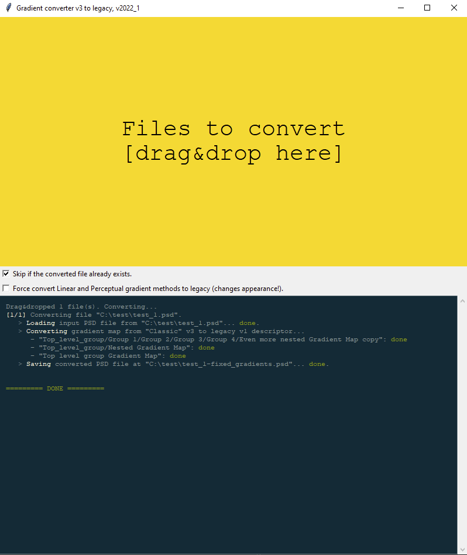
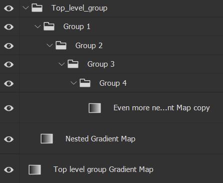

# PS v3 to legacy gradient converter

Converts new (v3) gradients to legacy (v1) gradients making it accessible in older versions of Adobe Photoshop[^1] (pre 22.0). Works directly with `psd` files.

## About

Simply drag and drop the `psd` file on the "Files to convert" field and the app will convert and store the result in a separate file with the `-fixed_gradients` suffix.

All gradient layers have to have a "Classic" mode set. If you want to convert gradients regardless of the mode, please check the "**Force convert Linear and Perceptual gradient methods to legacy (changes appearance!).**" option.

Currently only gradient map adjustment layers are supported.

### Donate

If you find this app useful you can say thank you by making a contribution:
[Ko-fi USD](https://ko-fi.com/devydd) | [PayPal USD](https://www.paypal.com/donate/?business=JP58DYMRDXRFA&no_recurring=0&item_name=%5BEUR%5D+Gradient-converter+donation&currency_code=USD) | [PayPal EUR](https://www.paypal.com/donate/?business=JP58DYMRDXRFA&no_recurring=0&item_name=%5BEUR%5D+Gradient-converter+donation&currency_code=EUR)

### Download

Compiled `exe` file available for download from the releases page:

- [`gradient_converter_v2022_1.exe` 64-bit, for Windows](https://github.com/devydd/ps-v3-to-legacy-gradient-converter/releases/download/v2022_1/gradient_converter_v2022_1.exe)
- [VirusTotal: 0/64](https://www.virustotal.com/gui/file/1546eafadf0bd315fbd16841c594c7d9e1be71ba0f934e09ac4cd0c8c69e6649/detection)
- sha256: `1546eafadf0bd315fbd16841c594c7d9e1be71ba0f934e09ac4cd0c8c69e6649`)
- it's a python script bundled by the `pyinstaller`, nothing fancy.

The picture above shows a sample output for the following layer structure:

[^1]: Adobe and Photoshop are either registered trademarks or trademarks of Adobe in the United States and/or other countries.

### Technical details

Based on the [psd-tools library](https://github.com/psd-tools/psd-tools) (minimal version required: v1.9.22, which includes the [pull request](https://github.com/psd-tools/psd-tools/pull/330) adding initial support for v3 gradient maps).

More context:

- <https://helpx.adobe.com/photoshop/using/whats-new/2022.html#:~:text=Improved%20Gradient%20tool>
- <https://community.adobe.com/t5/photoshop-ecosystem-bugs/p-gradient-map-adjustment-layer-ps-23-is-not-backward-compatible-even-in-classic-method/idi-p/12505807>
- <https://community.adobe.com/t5/photoshop-ecosystem-bugs/p-files-with-gradient-layers-created-in-22-5-2-look-different-in-23-0/idc-p/12490441>
